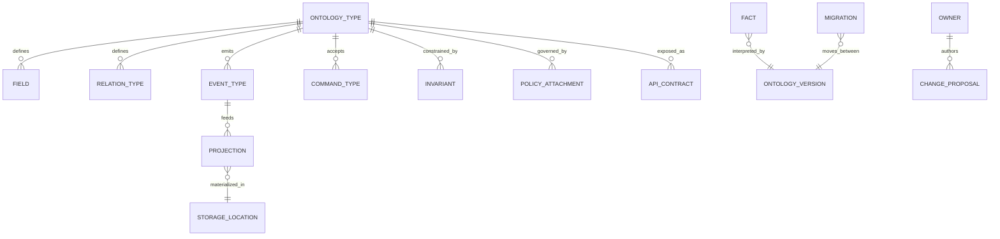
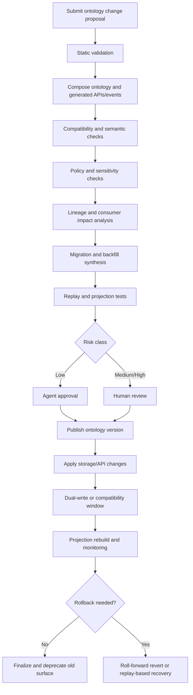
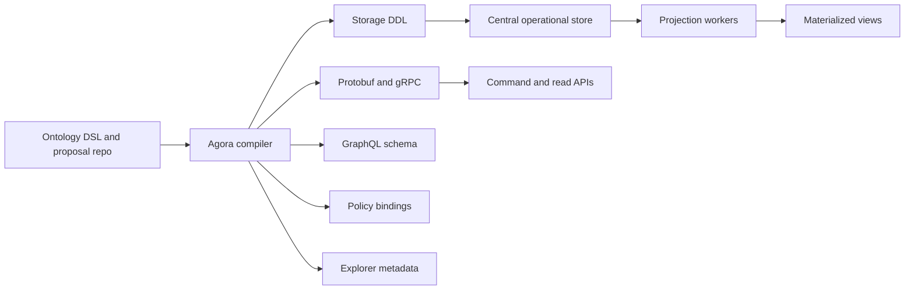
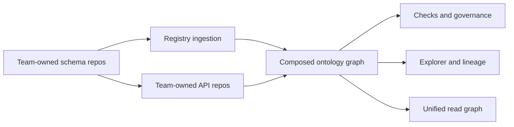
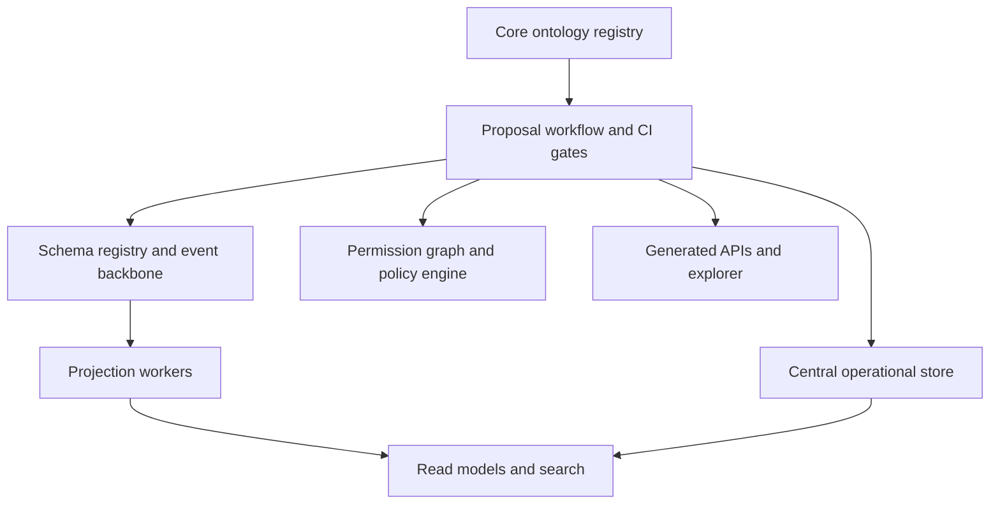

# Agora Prototype Report

## Executive summary

**Agora** should be understood as a **governed operational ontology and control plane** whose job is to give both **offline data** and **online/live operational data** a shared, evolvable structure that agents can safely build against. The core intent is to **unblock agentic chaos**: instead of letting every team or agent invent its own data model, database, and semantics, Agora provides canonical concepts, contracts, permissions, migrations, and discoverability while still allowing decentralized extension. That goal is broader than “a better database” and narrower than “a universal semantic web.” It is a platform for **shared business meaning with operational consequences**. citeturn1search8turn1search1turn2search0turn3search16

The strongest prior art is fragmented across layers rather than concentrated in one product. **TypeDB** and **RDF/OWL/SHACL** are the best prior art for rich conceptual modeling and semantic validation; **TerminusDB** is the clearest precedent for Git-like branch/diff/merge semantics over structured data; **XTDB** and **Datomic** are the strongest temporal/fact-history systems; **Confluent Schema Registry**, **Apollo GraphOS**, and **GraphQL Hive** are the best operational precedents for decentralized contract evolution with automated checks; **Zanzibar**, **SpiceDB**, **OpenFGA**, and **OPA** are the key prior art for permissions and policy; and **DataHub**, **OpenMetadata**, and **Backstage** provide the clearest patterns for ownership, lineage, discoverability, and code-adjacent metadata. No single mature system combines all of those capabilities in one coherent operational platform. citeturn0search0turn0search1turn0search2turn0search15turn1search11turn3search16turn3search2turn4search8turn1search8turn2search0

Under your stated preference for **centralized reliable storage**, plus explicit concerns about **multi-region, sharding, latency, throughput, reliability, and auditability**, **Spanner plus Protocol Buffers** is the strongest current substrate candidate. Spanner already provides globally distributed, synchronously replicated, externally consistent transactions, and exposes explicit schema-design guidance for splits, locality, and hotspot avoidance; Spanner also now supports a native **PROTO** data type in GoogleSQL. Protocol Buffers provide language-neutral typed payloads, code generation, field-numbered schema evolution, and custom options. Together, they solve a large part of the **storage plane and contract plane** problem. What they do **not** solve is Agora’s higher-order job: ontology registry, semantic compatibility, approval workflows, policy graph integration, lineage, migration intent, and promotion from local extension to shared core concept. citeturn4search0turn8search0turn8search2turn8search13turn4search1turn4search10turn4search19

The most credible prototype is therefore a **hybrid architecture**: a centralized operational store and event backbone underneath, with an **ontology/control plane** above it. In that shape, Agora does not replace the database; it **compiles** ontology changes into storage schema, protobuf contracts, command APIs, read APIs, authorization attachments, migration plans, and explorer metadata. If you are on Google Cloud and care about proving the end-state operational posture early, the default recommendation is **Agora Hybrid on Spanner + Protobuf**. If you want a cheaper or faster M0 to test ergonomics before committing to the final substrate, a **PostgreSQL-backed registry plus generated artifacts** is a reasonable short-term stand-in, but it is a poorer proof for multi-region and operational scale. citeturn4search0turn8search0turn9search2turn1search11turn3search16

A successful demo should prove five things, not just one. It should show that a product or agent can **propose a new concept or extension**, that Agora can **detect reuse versus duplication**, that the system can **generate operational artifacts** from the proposal, that **safe additive changes** can be approved and rolled out automatically while **meaning-changing or policy-sensitive changes** are blocked or escalated, and that the resulting objects are **discoverable, auditable, replayable, and permissioned** from the start. If the demo does only schema exploration or only code generation, it will undershoot the actual thesis. citeturn3search0turn3search21turn2search1turn1search0turn9search0

## What Agora is trying to build and why

The cleanest statement of intent is this:

> **Agora is a governed operational ontology and control plane for shared business-domain primitives, designed to let products and agents move quickly without forking reality.**

That intent matters because the failure modes are already well known. Warehouses and metadata catalogs are very good at **describing** offline data assets, lineage, business glossary terms, and contracts, but they usually do not govern the write path for live operational entities. Conversely, central core-service teams can provide coherent shared objects, but they become throughput bottlenecks when every product or agent must wait on people to model or approve every change. Schemaless document stores avoid the bottleneck, but they tend to externalize semantic coherence into tribal knowledge, conventions, and post-hoc cleanup. DataHub, OpenMetadata, and Backstage all show valuable pieces of the answer—ownership, catalogs, descriptors, lineage, contracts, discoverability—but they are not, by themselves, the operational control plane for live domain truth. citeturn1search8turn1search1turn2search0turn2search12

Your specific target is sharper than “enterprise ontology.” You are trying to impose enough structure over **both at-rest offline data and live online data** that agents can safely explore, reuse, extend, and integrate around canonical business concepts such as institutions, integrations, accounts, transactions, customers, permissions, and capabilities. That means Agora needs to mediate not just table shapes, but also **meaning**, **ownership**, **contracts**, **permissions**, **temporal interpretation**, and **materialized projections**. The practical reason is not academic neatness; it is to keep agentic product development from degenerating into local schemas, duplicated concepts, and unreliable cross-product joins. That is exactly why the best analogies come from metadata catalogs, software catalogs, schema registries, federated API registries, and authorization systems rather than from one “magic database.” citeturn1search8turn2search0turn1search11turn3search17turn3search2

The working assumptions for this report are: **scale is unspecified; latency and throughput SLAs are unspecified; regulatory and residency constraints are unspecified; cloud-provider preference is unspecified; centralized reliable storage is preferred to many app-specific databases; and the proof of concept should optimize for ergonomics and scalability with as little compromise as possible on latency, throughput, reliability, and auditability.** Those assumptions matter because they push the design toward a central operational substrate with explicit partitioning and locality metadata, not toward a purely federated sprawl of app-local stores. They also make Spanner, CockroachDB, and carefully designed relational schemas more relevant than purely local-first or per-team database approaches. citeturn4search0turn5search1turn9search2turn8search2

The right mental model is not “one flexible schema.” It is a small set of distinct planes:

- an **ontology plane** for concepts, relations, invariants, and semantic ownership;
- a **contract plane** for protobuf, GraphQL, event schemas, commands, and compatibility;
- a **storage plane** for canonical state and temporal history;
- a **policy plane** for object relationships, conditional access, and governance rules;
- a **projection plane** for read models, explorer views, and materialized products;
- and a **catalog plane** for discovery, lineage, and operational metadata. citeturn4search10turn3search17turn5search19turn3search2turn1search0turn2search0



What would prove the concept in a demo is therefore not just “a nice explorer” and not just “global transactions.” A convincing demo would show the following workflow in one vertical slice: a developer or agent proposes a new or extended concept; Agora either links it to an existing canonical concept or flags duplication; automated checks classify the change; Agora generates storage, contracts, APIs, and policy bindings; a low-risk additive change is published through CI; a high-risk semantic or permission change is blocked or escalated; writes happen only through generated commands; and historical replay plus audit logs can explain what happened and why. That is the minimal shape of a proof that Agora reduces agentic chaos rather than merely documenting it. citeturn3search0turn3search21turn2search20turn9search0turn3search12

## Taxonomy of prior art and theoretical foundations

The prior art becomes much clearer when mapped by problem dimension rather than by product category.

| Problem dimension | Best-fit prior art | Why it matters for Agora | Primary sources |
|---|---|---|---|
| Ontology registry | OWL, SHACL, TypeDB, OpenMetadata glossary | Shared concepts, classes, relations, constraints, definitions | citeturn0search6turn0search2turn0search1turn1search1 |
| Schema/versioning | Confluent Schema Registry, Protobuf, Apollo GraphOS, Hive | Version IDs, compatibility, CI checks, generated clients | citeturn1search11turn1search7turn4search1turn3search0turn2search20 |
| Branching/merge | TerminusDB, Git-backed Backstage descriptors, Apollo proposals, Hive approvals | Proposed changes need reviewable diffs, branch context, merge semantics | citeturn0search0turn0search12turn2search12turn3search21turn2search1 |
| Semantic validation | SHACL, OWL profiles, TypeDB constraints, custom Apollo checks, OPA | Shape checks are not enough; meaning and policy need validation | citeturn0search2turn0search6turn0search1turn3search10turn4search2 |
| Migration tooling | Confluent migration rules, Axon event versioning, TerminusDB schema migration patterns | Safe evolution requires declarative transforms and staged rollout | citeturn1search3turn5search3turn0search12 |
| Bitemporality/event sourcing | Snodgrass temporal databases, XTDB, Datomic, Fowler, EventStoreDB | Need to answer both “what was true then?” and “what did we know then?” | citeturn9search1turn9search19turn0search15turn2search18turn9search0turn5search19 |
| API composition/generation | Apollo Federation, Hive, Backstage API catalog, Protobuf/gRPC | Shared concepts must compile into usable interfaces | citeturn3search17turn3search1turn2search1turn2search15turn4search1 |
| Policy/permissions | Zanzibar, SpiceDB, OpenFGA, OPA/Rego | Shared truth without integrated access control is unsafe | citeturn3search2turn4search9turn3search3turn4search8 |
| Provenance/lineage | DataHub, OpenMetadata, TerminusDB commit graph, Datomic history | You need dependency graphs, ownership, history, and impact analysis | citeturn1search0turn1search5turn0search16turn2search14 |
| Storage vs control-plane role | FoundationDB layers, Spanner + F1, Backstage descriptors, DataHub aspects | Semantics and storage should be separable but connected | citeturn5search4turn9search3turn2search12turn1search8 |
| Materialized projections/read models | EventStoreDB projections, Fowler CQRS/event sourcing, DataHub lineage views | Read models should be derivable and rebuildable, not hand-maintained forever | citeturn5search2turn5search10turn9search0turn1search0 |
| Ops/scalability | Spanner, CockroachDB, FoundationDB, PostgreSQL partitioning, Meta ZippyDB | Centralization must still respect sharding, locality, and operational realities | citeturn4search0turn5search1turn5search4turn9search2turn7search10 |

The theoretical foundation is already fairly mature. **OWL** provides a formal language for publishing and sharing ontologies, while **SHACL** provides a graph-native constraint language for validating data against shapes. **Datalog** remains a core reference point for logic-based query and inference over facts, and TypeDB’s recent **TypeQL** research pushes toward a more typeful, polymorphic query model that treats relationships as first-class schema elements rather than as impoverished join glue. These traditions matter because Agora’s ontology layer needs stronger semantics than SQL DDL alone, especially if the same concepts have to power agents, APIs, permissions, explorer UIs, and migrations. citeturn0search6turn0search2turn10search1turn10search0

Time and history have equally deep foundations. Snodgrass’s temporal database work distinguishes modeled-world time from database-recorded time and explains why temporal support must represent both if the system needs to answer when something was true and when it was known. Fowler’s event-sourcing pattern gives the operational software formulation of that same intuition: persist all changes as a sequence of events and derive current state from them when needed. XTDB and Datomic are the clearest modern databases carrying those ideas into product form, with XTDB making bitemporality explicit and Datomic emphasizing immutable facts, history, and as-of views. citeturn9search1turn9search19turn9search0turn0search15turn2search18

Authorization and governance also have mature theory and practice. Google’s **Zanzibar** paper shows that large-scale, consistent object authorization can be modeled as relationships and evaluated with a uniform schema and configuration language across many applications. **OpenFGA** and **SpiceDB** productize Zanzibar-style tuple-based and schema-based authorization for broader use, while **OPA/Rego** supplies a general policy language for richer contextual and compliance-oriented decisions. That split—ReBAC for graph relationships, policy-as-code for high-order predicates—is extremely relevant for Agora because ontology objects, APIs, and fields will often need both styles of control. citeturn3search2turn3search3turn4search9turn4search8turn4search2

Large-tech practical experiments reinforce the same decomposition. Google’s **Spanner** and **F1** show that you can combine globally distributed, externally consistent storage with strongly enforced schemas, indexing, change tracking, and SQL at enormous scale. LinkedIn’s **DataHub** shows how a metadata graph, ownership model, and lineage impact analysis can become a central discovery and governance layer, and LinkedIn’s “shift left on governance” work shows the value of attaching controlled vocabulary and governance metadata closer to source schemas. Stripe’s public writing on API versioning and zero-downtime data migrations shows how seriously a payments infrastructure company treats long-lived contracts and safe evolution. Meta’s public work on TAO cache consistency and ZippyDB emphasizes how much distributed operational reliability depends on carefully designed semantics around state propagation and consistency, not just raw storage. Practical public material from trading firms is comparatively sparse, but the financial-infrastructure patterns that matter most here—auditability, contract evolution, permissions, time-aware record keeping, and reliable projections—are well represented in Google, LinkedIn, Stripe, Meta, and some fintech engineering writing. citeturn4search0turn9search3turn9search11turn7search0turn7search11turn1search0turn6search0turn6search4turn7search3turn7search10

## Prior-art items and technology comparison

The table below compresses the major systems and standards into one analytical view. The **maturity** assessment is a synthesis of official docs, public release posture, and breadth of production usage described by their maintainers; it is not an independent benchmark.

| Item | Short description and mapped dimensions | Strengths | Limitations | Maturity | Suggested lesson to adopt | Primary sources |
|---|---|---|---|---|---|---|
| **TerminusDB** | Version-controlled document graph with branch/diff/merge/time-travel; maps strongly to ontology registry, branching/merge, provenance, and proposal workflows | Native data revision control; immutable delta layers; collaboration model is unusually close to “PRs for data” | Less mainstream than relational stacks; not a complete auth/policy/runtime API platform by itself | Medium | Treat ontology changes as **branchable, reviewable, mergeable artifacts** | citeturn0search0turn0search12turn0search16 |
| **TypeDB / TypeQL** | Knowledge-engineering database and typeful query language with first-class entities, relations, attributes, constraints, and a formal theory; maps to ontology registry and semantic validation | Rich conceptual model; first-class relations and roles; stronger semantics than typical schema DSLs | No first-class Git-style branch/merge; ops and ecosystem narrower than Postgres/Spanner | Medium | Borrow its **conceptual schema vocabulary** even if not used as the primary store | citeturn0search1turn0search13turn10search0 |
| **DataHub** | Metadata graph and data catalog with lineage, impact analysis, ownership, and extensible metadata aspects; maps to lineage, provenance, discovery, governance | Strong ownership and lineage model; aspect-based extensibility; impact-analysis workflows | Offline/data-platform oriented; not a live operational write-path control plane | High | Copy the **ownership + lineage + impact-analysis** patterns | citeturn1search8turn1search0turn7search0turn7search11 |
| **OpenMetadata** | Metadata/governance platform with contracts, lineage APIs, glossary and versioned entities; maps to lineage, glossary, governance history | Clear contract objects; lineage APIs; glossary/business metadata integration | Not a central operational store for live domain writes | High | Borrow the **governance object model** and contract metadata shape | citeturn1search1turn1search5turn1search17 |
| **Backstage** | Software catalog with YAML descriptors stored close to code, ownership, APIs, systems, resources; maps to discovery, ownership, code-adjacent metadata | Strong precedent for distributed stewardship via descriptors in Git; extensible portal UX | Catalogs software topology, not business ontology or temporal truth | High | Put **descriptors near code**, but keep promoted ontology core authoritative | citeturn2search0turn2search12turn2search15 |
| **Confluent Schema Registry** | Central schema/data-contract repository with compatibility modes and migration rules; maps to schema/versioning, migration, event contracts | Mature compatibility enforcement; version history; registry APIs; transformer-oriented contract model | Mostly shape-level, event/data focused; not deep domain ontology | High | Every proposal needs a **compatibility class** and **migration story** | citeturn1search11turn1search7turn1search3turn1search22 |
| **Apollo Federation / GraphOS** | Federated GraphQL supergraph with composition, schema checks, proposals, and custom checks; maps to API composition and decentralized schema governance | Strong composition model; consumer-aware checks; proposal workflows; custom validations | Focused on GraphQL interface layer, not ontology semantics or temporal storage | High | Adopt **compose-check-approve-publish** for shared APIs | citeturn3search17turn3search1turn3search0turn3search21turn3search10 |
| **GraphQL Hive** | OSS-first GraphQL registry and gateway with breaking-change awareness and branch-context approval semantics; maps to decentralized API governance | Strong PR/branch change flows; usage-aware breaking-change evaluation; self-hostable | Same scope limits as Apollo: API layer, not full ontology control plane | Medium to High | Use **usage-based impact analysis** for API-facing ontology changes | citeturn2search1turn2search5turn2search20turn2search9 |
| **Datomic** | Immutable fact database with historical/as-of views; maps to immutable facts, provenance, historical interpretation | Excellent history model; facts not rows; as-of and history are first-class | No first-class branch/merge; not ubiquitous bitemporality in the XTDB sense | Medium | Model current state as a **derived view over accumulated facts** | citeturn2search18turn2search3turn2search14 |
| **XTDB** | Dynamic relational database with explicit bitemporality and immutable history; maps to temporal truth, corrections, and auditability | Best fit for “what was true then / known then”; regulated-data framing; immutable history | Separate ontology/control plane still needed; 2.x posture requires careful validation | Medium | If valid-time correctness matters, make **bitemporality** explicit early | citeturn0search15turn0search11turn0search23 |
| **Zanzibar / SpiceDB / OpenFGA** | Relationship-based authorization family; maps to permissions, delegated ownership, object-level access | Excellent model for graph-shaped permissions; conditions/caveats and expiry exist in OSS descendants | Authorization only; not ontology registry, lineage, or migrations | High for pattern; Medium/High for OSS products | Treat **authorization as its own graph**, not scattered ad hoc checks | citeturn3search2turn4search9turn4search3turn4search12turn3search3turn3search6 |
| **OPA / Rego** | Declarative policy engine and language for structured-data policy evaluation; maps to governance rules and CI/runtime policy | Good for context-aware rules, compliance, CI gates, and API authorization | Not a relationship store; needs pairing with a graph or registry | High | Pair ReBAC with **policy-as-code** instead of forcing one engine to do both | citeturn4search8turn4search2turn4search11 |
| **RDF / OWL / SHACL** | Semantic-web standards for ontologies and graph validation; maps to ontology formalism and semantic constraints | Mature standards; explicit semantics and constraints; strong conceptual vocabulary | Tooling ergonomics often weaker for operational product teams | High | Use them as a **semantic reference model** even if implementation is not RDF-native | citeturn0search6turn0search2turn0search14 |
| **EventStoreDB / Axon / event-sourcing frameworks** | Event-native storage and frameworks for event sourcing, projections, and versioning; maps to event backbone and read-model rebuilds | Strong replay/projection model; event-versioning patterns; auditability | Event sourcing alone does not solve ontology governance | Medium to High | Use event streams for **replayable projections**, not as the whole platform | citeturn5search6turn5search19turn5search2turn5search3turn5search17 |
| **FoundationDB** | Strictly serializable distributed KV store with a “layers” philosophy; maps to storage-vs-control-plane separation | Excellent architectural precedent for layering richer semantics above a narrow core | Too low-level for a first Agora prototype unless you want to build many layers | High | Do not over-couple **storage engine** and **semantic control plane** | citeturn5search4turn5search0 |
| **PostgreSQL** | Mature centralized relational store with partitioning and broad tooling; maps to pragmatic registry/canonical store prototyping | Lowest risk for a cheap M0; excellent ecosystem; good controlled central storage baseline | Weak native story for global multi-region external consistency and semantic automation | High | Good M0 substrate, but it does not prove the final global-operational thesis by itself | citeturn9search2turn9search6turn9search20 |
| **CockroachDB** | Distributed SQL database presenting one logical SQL system across nodes; maps to centralized distributed storage | Better fit than plain Postgres when you need one logical store with distributed operational characteristics | Still only a storage substrate; ontology, policy, and migration semantics remain separate problems | High | Viable alternative if GCP/Spanner is not preferred | citeturn5search1turn5search21turn5search5 |
| **Spanner + Protobuf** | Global, synchronously replicated SQL store plus typed schema/contract language with codegen and native PROTO columns in Spanner; maps to storage plane, contracts, and operational scale | Best combined story for centralized reliable storage, multi-region, sharding, and typed payload evolution | Still lacks ontology brokering, semantic approvals, lineage graph, and policy semantics out of the box | High | Use it as the **default substrate**, not as the entire solution | citeturn4search0turn8search0turn8search2turn8search13turn4search1turn4search10turn9search3 |

The comparison matrix below rates **documented first-class support**, not hypothetical extensibility. **H** means strong first-class support; **M** means partial or adjacent support; **L** means weak or not core.

| Technology | Schema versioning | Branch/merge | Semantic validation | Migration tooling | Bitemporality | API generation/composition | Policy integration | Provenance/lineage | Scalability | Ops complexity | Recommended role | Prototype |
|---|---:|---:|---:|---:|---:|---:|---:|---:|---:|---:|---|---|
| TerminusDB | H | H | M | M | M | M | L | M | M | M | Control-plane candidate for ontology and proposal history | Yes |
| TypeDB | M | L | H | M | L | L | L | M | M | M | Semantic-modeling benchmark or niche store | Yes |
| DataHub | M | L | M | L | L | M | M | H | M | M | Catalog/lineage adjunct | Maybe |
| OpenMetadata | M | L | M | L | L | M | M | H | M | M | Catalog/governance adjunct | Maybe |
| Backstage | M | M via Git | L | L | L | M | M | M | M | M | Explorer and code-adjacent metadata UI | Yes |
| Confluent Schema Registry | H | L | M | H | L | L | M | M | H | M | Event/schema contract registry | Yes |
| Apollo Federation / GraphOS | H | M | M | M | L | H | M | M | H | M | API composition control plane | Yes |
| GraphQL Hive | H | M | M | M | L | H | M | M | M | M | OSS API registry/control plane | Yes |
| Datomic | M | L | M | M | M | L | L | H | M | M | Immutable fact store | Maybe |
| XTDB | H | L | M | M | H | L | L | H | H | H | Temporal canonical store under a control plane | Yes |
| Kafka + Schema Registry | H | L | M | H | M | L | M | H | H | H | Contracted event backbone and rebuildable projections | Yes |
| Zanzibar / SpiceDB / OpenFGA | M | L | M | M | L | L | H | M | H | M | Authorization graph | Yes |
| OPA / Rego | M via Git | M via Git | H | C | L | L | H | L | H | M | Policy engine | Yes |
| RDF / OWL / SHACL | C | C | H | C | L | L | L | M | M | M | Ontology/constraint reference model | Yes |
| EventStoreDB / Axon | M | L | L | H | M | L | L | H | H | M | Event backbone and projection engine | Maybe |
| FoundationDB | L | L | L | L | L | L | L | L | H | H | Low-level substrate only | No for first prototype |
| PostgreSQL | M | L | M | M | C | C | C | C | M | L | Cheap M0 store/registry | Yes |
| CockroachDB | M | L | M | M | C | C | C | C | H | M | Distributed SQL substrate | Maybe |
| Spanner + Protobuf | H | L | M | M | M with extra design | H for protobuf/gRPC, M for graph composition | C | M | H | M | Preferred centralized storage + contract substrate | Yes |

Two high-level conclusions follow from the comparison. First, **Spanner + Protobuf** is currently the strongest “boring-powerful” base for the sort of operational proof you care about: centralized reliable storage, multi-region configurations, splits, and a clear typed-contract layer all already exist. Second, almost every other system in the table is better seen as a **specialized control-plane or adjunct component** rather than a replacement for that base. In other words: Spanner+Protobuf solves much of the **how to store and move the bits** problem; Agora still has to solve the **what the bits mean, who can change them, how they evolve, and how others discover and trust them** problem. citeturn4search0turn8search0turn8search2turn3search16turn1search11turn3search2turn1search0

## Agora protocol and prototype architectures

The core protocol object should be an **ontology change proposal** rather than a raw DDL change or ad hoc schema diff. That is the right unit because Agora is meant to govern **meaningful concepts**, not just column layout. Practical inspiration comes from GraphOS proposals and checks, Hive’s branch-context approvals, Confluent compatibility rules, TerminusDB version history, and OpenFGA or SpiceDB model testing. citeturn3search21turn3search0turn2search1turn1search7turn0search12turn3search12

A credible proposal schema should capture at least the following:

```yaml
kind: OntologyChangeProposal
proposal_id: ocp_2026_05_14_001
submitted_at: 2026-05-14T14:20:00Z
submitted_by:
  actor: agent://schema-broker-1
  delegated_from: user://domain-owner

domain: integrations
namespace: core.integrations
target_ontology_version: 12.4

change_intent:
  class: add_relation
  summary: Add AuthenticationMethod relation to BankIntegration
  rationale: Replace provider-specific flags with canonical capability model

affected_assets:
  entity_types: [BankIntegration, AuthenticationMethod]
  api_contracts: [GraphQL:BankIntegration, gRPC:UpdateIntegration]
  event_types: [IntegrationCapabilityObserved]
  projections: [IntegrationExplorerView, ProviderCapabilityIndex]

semantic_contract:
  meaning_before: "Auth support implied by provider-specific flags"
  meaning_after: "Auth support represented as relation to canonical methods"
  invariants:
    - "Every active BankIntegration has at least one supported AuthenticationMethod"
    - "Legacy flags remain derivable during compatibility window"
  classifications: [internal, non_pii]

compatibility:
  shape: additive
  semantic: refinement
  temporal: no_change
  policy: no_change
  api: additive_with_deprecation
  storage: requires_backfill

ownership:
  domain_owner: team://integrations-platform
  semantic_steward: team://core-ontology
  security_owner: team://security-platform

migration:
  storage_plan:
    - add_relation AuthenticationMethod
    - create_compatibility_view legacy_provider_flags
  backfill_plan:
    source: provider_config.current_auth_modes
    idempotent: true
  event_plan:
    upcasters: [IntegrationCapabilityObserved:v2]
  projection_plan:
    rebuild: [IntegrationExplorerView]
  rollout:
    dual_write_window: 14d
    deprecation_window: 90d

tests:
  fixtures: [provider_auth_sample_set]
  invariant_checks: [cardinality, derivability, permission_regression]
  replay_tests: [historical_capability_replay]
  policy_tests: [no_new_visibility]

provenance:
  source_docs: [RFC-247, provider-api-spec-v3]
  related_commits: [abc123, def456]

rollback:
  strategy: roll_forward_revert
  compatibility_views: [legacy_provider_flags]
```

The required metadata should force decisions that teams and agents often postpone: **owner, semantic intent, namespace, compatibility classification, sensitivity and data class, locality or residency, storage or partitioning hint, migration and backfill plan, tests, provenance, and policy effect**. That is one of the central insights from this research: the unsolved problem is not missing storage engines; it is missing **semantic discipline** in the change protocol. Compatibility must be multi-axis: not just backward/forward shape compatibility, but also semantic compatibility, temporal compatibility, policy compatibility, and operational compatibility. citeturn1search7turn1search3turn3search0turn9search19

The automated checks should be equally layered:

| Check category | What it should evaluate | Borrowed precedent |
|---|---|---|
| Composition checks | Does the ontology still compose? Do generated APIs and events remain internally coherent? | Apollo composition and federated checks, Hive schema checks citeturn3search1turn3search5turn2search20 |
| Compatibility checks | Are changes additive, breaking, dangerous, or safe under declared policies? | Confluent compatibility modes; GraphOS checks citeturn1search7turn3search7 |
| Semantic checks | Does the change overlap an existing concept, violate constraints, or change meaning without declaration? | SHACL, TypeDB constraints, custom check hooks citeturn0search2turn0search1turn3search10 |
| Policy checks | Does read or write visibility expand? Do field classifications change? | Zanzibar-family auth + OPA/Rego citeturn3search2turn4search8 |
| Temporal checks | Does the change reinterpret recorded history or valid-time semantics? | Snodgrass temporal modeling; XTDB bitemporal posture citeturn9search1turn0search15 |
| Impact analysis | Which APIs, views, jobs, services, and consumers are affected? | DataHub impact analysis, Hive affected deployments citeturn1search0turn2search9 |
| Replay/projection checks | Can projections rebuild from events/history after the change? | EventStoreDB projections, Fowler event sourcing, Axon versioning citeturn5search2turn9search0turn5search3 |

Agentic approval should be allowed only when all of the following are true: the change is local or namespaced; it is **additive or a declared refinement**; it does not expand visibility or lower sensitivity; it preserves partitioning and residency assumptions; it has zero or tolerable downstream consumer impact; and migration or replay checks pass. Human approval should be required for destructive changes, semantic meaning changes, permission expansions, temporal reinterpretations, and storage-key or locality changes. That thresholding borrows the spirit of GraphOS and Hive, but extends it beyond API breakage into semantic and policy risk. citeturn3search0turn2search1turn3search13

Rollback should default to **roll forward to revert** at the contract layer, with compatibility views and deprecation windows rather than instantaneous destructive reversal. For the data plane, rollback should prefer immutable history, replay, or corrective writes over direct in-place mutation. That is consistent with Apollo’s schema-management guidance, event-sourcing practice, and temporal-fact systems such as Datomic and XTDB. citeturn3search0turn9search0turn2search14turn0search15



Three architecture options are credible.

The **ontology-first** option makes Agora’s ontology DSL the source of truth and compiles storage, contracts, APIs, and policy from it. This is the cleanest semantically, closest to the vision, and most demanding to implement. It should be chosen only if you explicitly want to invest in a true compiler and enforce “ontology-first” on product teams. citeturn0search2turn4search1turn8search0



The **federated registry** option makes service-owned or code-owned artifacts the source of truth and builds a central catalog, registry, and governance layer above them. This is easiest to adopt socially and closely matches Backstage plus Apollo/Hive patterns, but it risks becoming descriptive rather than prescriptive if the registry does not control merge and deployment gates. citeturn2search0turn3search17turn2search1



The **hybrid** option is the strongest recommendation. Keep a relatively small, high-quality **core ontology** under stronger governance, allow product-local or domain-local **namespaced extensions**, and provide a promotion path from local extension to shared concept. Put a centralized operational substrate beneath it, with generated contracts and APIs, and preserve immutable history through events or mutation logs. This option aligns best with your stated intent: central structure without central human bottleneck. citeturn4search0turn8search0turn1search11turn3search2



For each architecture, the minimal viable stack looks like this:

| Option | Best when | Minimal viable stack | Main tradeoff |
|---|---|---|---|
| Ontology-first | You want maximal semantic coherence and can afford compiler work | Registry + ontology DSL, compiler, central store, protobuf, gRPC, GraphQL, policy engine, explorer | Highest implementation complexity, strongest long-term payoff |
| Federated registry | You need adoption speed and already have many service-owned schemas | Backstage, Apollo or Hive, schema registry, metadata graph, policy hooks, central catalog | Easiest social path, weakest semantic enforcement |
| Hybrid | You want centralized reliable storage plus decentralized extension | Core registry + proposal workflow, central store, protobuf, schema registry, gRPC commands, GraphQL reads, auth graph, policy engine, explorer | Best balance, but requires careful namespace and promotion rules |

If Google Cloud is acceptable, the **default hybrid stack** should be: **Spanner** for canonical operational storage; **Protocol Buffers** for typed payloads and generated services; **gRPC** for command and service reads; **GraphQL** via Apollo Federation or Hive for exploration and composition; **Schema Registry** for event and message contracts; **Kafka or Pub/Sub** for event transport; **SpiceDB or OpenFGA plus OPA/Rego** for authorization and policy; and **Backstage plus a custom plugin or thin catalog app** for the explorer. If GCP is not acceptable or cost-to-learn matters more for M0, swap the first piece for **PostgreSQL** or possibly **CockroachDB**, but keep the same control-plane protocol. citeturn8search0turn4search1turn3search17turn2search1turn1search11turn3search15turn4search8turn2search0turn9search2turn5search1

## Novelty, build recommendations, and validation plan

What is **existing** in the Agora vision is already substantial: formal ontology languages, graph validation, versioned contracts, federated API composition, event sourcing, bitemporal databases, authorization graphs, metadata catalogs, and code-adjacent descriptors all exist. What is still meaningfully **novel** is the way you want to combine them into one operational platform for agents.

| Existing today | Novel or underdeveloped in Agora |
|---|---|
| Formal vocabularies and graph constraints in OWL/SHACL | Turning semantic ontology changes into a routine CI/CD workflow for application teams and agents |
| Contract/version governance in Confluent, Apollo, and Hive | Multi-axis compatibility classifications that include **semantics, policy, and temporal interpretation**, not just shape |
| Event replay and projections in event-sourcing systems | Automatically synthesizing migrations and replay plans from semantic diffs |
| ReBAC and policy-as-code in Zanzibar-family systems and OPA | A unified model where permissions are attached to ontology concepts, generated APIs, and field-level data classes |
| Metadata graphs in DataHub/OpenMetadata and software catalogs in Backstage | One explorer/control plane that covers **live operational entities, offline assets, APIs, events, contracts, policies, lineage, and ownership** in one navigable graph |
| Temporal databases such as XTDB and historical stores such as Datomic | Cleanly interpreting historical facts under **evolving ontology versions** and preserving explainability for agents |

That novelty point is important. The hardest unresolved problem is not “how to store records in many regions.” Spanner, CockroachDB, FoundationDB, and F1 already show that large-scale reliable operational storage is possible. The harder problem is **semantic control under decentralized change**: deciding whether a proposal is actually new, a synonym, a refinement, a semantic break, a policy break, or a temporal reinterpretation; deciding who or what may approve it; and generating operational changes without losing history or blowing up downstream consumers. citeturn4search0turn9search3turn5search1turn5search4turn3search0turn1search7

The projects below are ordered from smallest to most ambitious.

| Recommendation | Architecture and stack | Key risks | Success criteria | Effort |
|---|---|---|---|---|
| **M0 governance slice** | PostgreSQL-backed registry, Git proposals, protobuf, generated gRPC commands, simple explorer, OPA, one permission service | Might prove ergonomics but not final ops posture | One domain can be proposed, generated, discovered, permissioned, and migrated end-to-end in a week or two | Small |
| **M1 Agora Hybrid on Spanner + Protobuf** | Spanner canonical store and registry, protobuf, gRPC, GraphQL explorer, schema registry, mutation log, OpenFGA or SpiceDB, OPA | More cloud cost and infra setup; must avoid turning into “typed blobs in Spanner” | Demonstrates centralized reliable storage, explicit partitioning/locality, safe additive evolution, auditability, and generated interfaces | Medium |
| **M1b Hybrid on CockroachDB + Protobuf** | Same control plane, CockroachDB instead of Spanner | Less direct proof of end-state if GCP is likely; multi-region behavior differs | Demonstrates one-logical-store model without cloud lock-in | Medium |
| **M2 ontology-branching lab** | TerminusDB or Git-backed registry to prototype branch/diff/merge semantics for ontology proposals | Could become a side-track if treated as the whole runtime | High-quality proposal diffs, merge semantics, and history become dramatically easier to reason about | Small to Medium |
| **M2 temporal lab** | XTDB spike or Postgres/Spanner + immutable mutation log + projection rebuilders | Could over-focus on temporal purity before ergonomics are proven | You can answer both valid-time and transaction-time questions after corrections and replay | Medium |
| **M3 full Agora hybrid** | Spanner + Protobuf + schema registry + GraphQL + auth graph + OPA + explorer + projections + promotion workflow | Broadest build; risk of overscoping before approving core abstractions | Multiple products and agents can propose, reuse, and evolve shared concepts safely with measurable reduction in duplicate modeling | Large |

The most practical recommendation is to run **one flagship path** and **two narrow spikes** in parallel. The flagship path should be **M1 Agora Hybrid on Spanner + Protobuf**, because that aligns with your stated requirements: centralized reliable storage, multi-region readiness, sharding support, low compromise on latency and throughput, and a serious operational substrate. The two narrow spikes should be **M2 ontology-branching** using TerminusDB or a Git-backed registry and **M2 temporal** using XTDB or a strict append-only mutation log with replay tooling. That structure de-risks the two genuinely open questions—change-workflow semantics and historical interpretation—without letting them paralyze the first build. citeturn4search0turn8search0turn0search0turn0search15

The demo that would best prove the concept should be explicit and scripted. A strong demo script would look like this:

1. A product agent proposes a new concept or extension, such as `BankIntegrationCapability`.  
2. Agora links it to existing related concepts and either reuses a canonical type or creates a namespaced extension.  
3. The proposal triggers compatibility, policy, and impact checks; the report shows affected APIs, views, and consumers.  
4. Agora generates storage schema, protobufs, command handlers, GraphQL types, policy bindings, and explorer docs.  
5. A low-risk additive proposal is automatically approved and published.  
6. A second proposal that quietly changes semantic meaning or expands visibility is blocked and escalated.  
7. Writes flow through generated commands; reads show both current state and historical explanation.  
8. The explorer shows owner, invariants, lineage, policy, and version history of the concept.  

If you can demo those eight beats with real operational writes and history—not mocked screenshots—you have proven the essential thesis. citeturn3search21turn3search0turn1search0turn9search0turn3search2

The P0–P2 validation plan should then be:

| Priority | Hypothesis | Method | Success metric | Minimal artifact |
|---|---|---|---|---|
| **P0** | Agents can safely propose low-risk ontology changes if the protocol forces semantic intent, compatibility class, and tests | Build proposal schema, automated checks, and one approval threshold path | Safe additive proposals merge with no manual schema surgery; risky proposals are escalated correctly | Proposal schema, checker, one CI workflow |
| **P0** | Spanner + Protobuf can serve as a serious canonical substrate without destroying ergonomics | Implement one domain on Spanner with hybrid relational + PROTO modeling and generated gRPC commands | Acceptable command latency, clear partition/locality design, readable generated APIs | One end-to-end domain slice |
| **P0** | Authorization must be first-class in the ontology/control plane | Integrate OpenFGA or SpiceDB and OPA on generated command/read paths | Every access decision is explainable and testable against ontology objects | One policy graph and test suite |
| **P1** | Branch/diff/merge semantics materially improve ontology evolution ergonomics | Spike TerminusDB or a Git-native registry for proposals and conflict handling | Review quality and comprehension of change diffs improve versus raw schema PRs | Branchable ontology repo or TerminusDB spike |
| **P1** | Temporal replay and correction handling are central enough to justify bitemporal semantics | Run an XTDB spike or append-only mutation-log replay experiment with late corrections | You can answer valid-time and system-time questions after corrections and schema changes | Replay harness + corrected-history queries |
| **P2** | Explorer discoverability is a force multiplier for agents and humans | Build a thin explorer showing concepts, commands, policies, owners, and lineage | Teams can find canonical objects and APIs without human routing | Explorer UI backed by registry APIs |

The clearest final recommendation is this: **prototype Agora as a hybrid control plane over a serious central substrate, not as a new universal database**. If you want the proof to speak directly to your end-state concerns—latency, throughput, reliability, auditability, multi-region, sharding—then **Spanner + Protobuf is the right substrate to prototype against**. The control plane above it should focus on ontology proposals, compatibility and policy checks, lineage, generated artifacts, and a developer-facing explorer. That is the narrowest build that still preserves the real intent: to bring **shared online and offline structure** to agentic development without collapsing into either committee bottlenecks or schema-free sprawl. citeturn4search0turn8search0turn3search16turn1search8turn2search0

A final limitation remains. Public documentation and papers are strong for Google, LinkedIn, Stripe, Meta, and the OSS systems above, but public engineering detail from major trading firms is comparatively sparse. That means the practical lessons here come mostly from large-scale tech and fintech infrastructure rather than from hedge-fund or market-maker internals. Even so, for the problem you are trying to solve—shared semantics, controlled evolution, safe contracts, permissions, history, and central operational reliability—the public prior art is already rich enough to justify a serious prototype. citeturn4search0turn3search2turn7search0turn6search0turn6search4